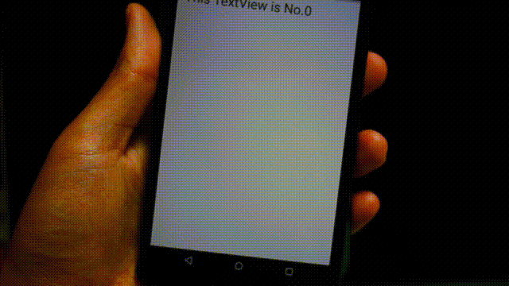

# ShakableViewPager


This library enable ViewPager to show next page with shaking Android device.

Please chack out exampleapp.
Exampleapp uses ShakableViewPager and shows infinite paging with shaking device.

# Demo



# How to Use

## Setup

```groovy
repositories {
    // ...
    maven { url "https://jitpack.io" }
}
compile 'com.github.petitviolet:shakable-viewpager:<VERSION>'
```

## Code snippet

Your MainActivity layout xml file.

```xml
<FrameLayout xmlns:android="http://schemas.android.com/apk/res/android"
                android:layout_width="match_parent"
                android:layout_height="match_parent"
                android:paddingBottom="@dimen/activity_vertical_margin"
                android:paddingLeft="@dimen/activity_horizontal_margin"
                android:paddingRight="@dimen/activity_horizontal_margin"
                android:paddingTop="@dimen/activity_vertical_margin">

    <!-- use ShakableViewPager same as ViewPager -->
    <net.petitviolet.shakableviewpager.ShakableViewPager
        android:id="@+id/view_pager"
        android:layout_width="match_parent"
        android:layout_height="match_parent"/>

</FrameLayout>
```

```java
public class MainActivity extends ActionBarActivity {
    private ShakableViewPagerHelper mShakableViewPagerHelper;

    @Override
    protected void onCreate(Bundle savedInstanceState) {
        super.onCreate(savedInstanceState);
        setContentView(R.layout.activity_main);
        // obtain ShakableViewPagerHelper instance
        ShakableViewPager viewPager = (ShakableViewPager) findViewById(R.id.view_pager);
        MyAdapter adapter = new MyAdapter(this);
        viewPager.setAdapter(adapter);
        // if not call enableSwipe(true), you cannot swipe ViewPager
        viewPager.enableSwipe(true);
        // handle device shake event
        mShakableViewPagerHelper = new ShakableViewPagerHelper(this, viewPager);
    }

    @Override
    protected void onResume() {
        super.onResume();
        // register at onResume
        mShakableViewPagerHelper.register();
    }

    @Override
    protected void onPause() {
        super.onPause();
        // unregister at onPause
        mShakableViewPagerHelper.unregister();
    }
}
```

# License

This code is licensed under the Apache Software License 2.0.
